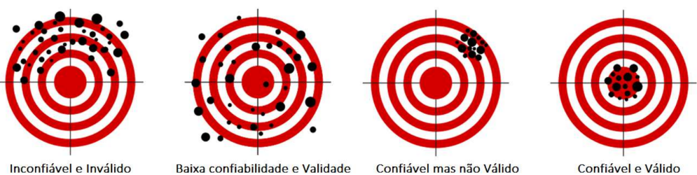
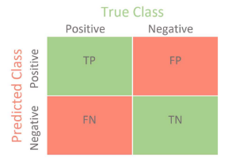
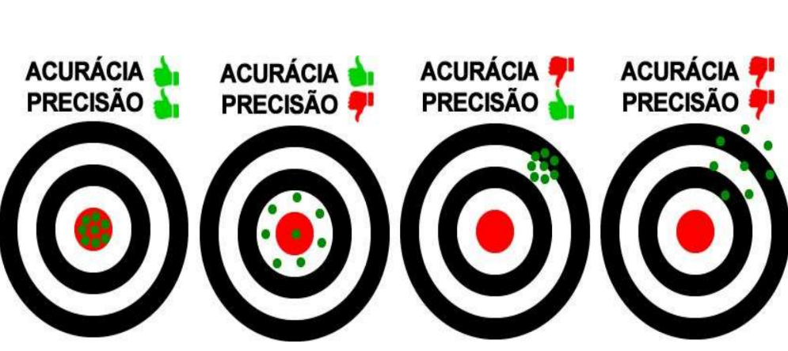

# Mensuração da Aplicabilidade de um Modelo

- A métrica utilizada pode refutar ou endossar a aplicação de um modelo.
- Utilizar métricas inadequadas pode validar a escolha de modelos inadequados.
- Cada problema possui uma abordagem ótima para mensurar os resultados de um modelo.

## Confiabilidade x Validade

## Matriz de Confusão

- Utilizada para avaliar o desempenho de um classificador.
- **True Positive (TP):** casos em que a classe (+) é classificada como (+).
- **False Positive (FP):** situações em que a classe (-) recebe classificação (+).
- **False Negative (FN):** situações em que a classe (+) é classificada como (-).
- **True Negative (TN):** casos em que a classe (-) recebe a classificação (-).

## Acurácia

- Número de acertos dividido pelo número de dados do teste.

## Precisão

- Número de resultados positivos corretos (TP) dividido pelo número de resultados positivos previstos pelo classificador (TP + FP).

## Recall (Revocação)

- Número de resultados positivos corretos (TP) dividido pelo número de todas as amostras que deveriam ter sido identificadas como positivas (TP + FN).
- Indica a frequência com que o classificador encontra os exemplos de uma classe.

## F1 Score

- Média harmônica das medidas precisão e recall.
- Proporciona um equilíbrio entre precisão e recall em uma única medida de desempenho.
- Melhor que a Acurácia, especialmente em casos onde falsos positivos e falsos negativos têm impactos diferentes para o modelo.
