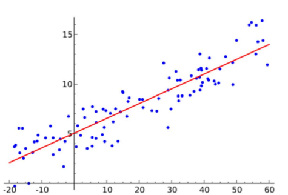
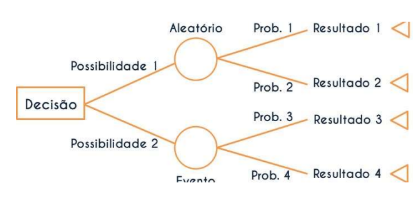
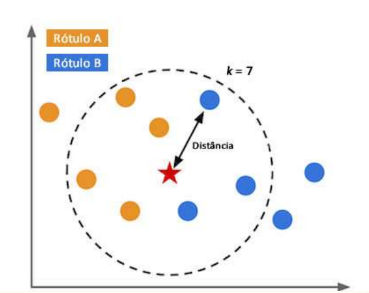
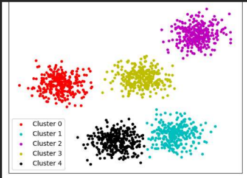
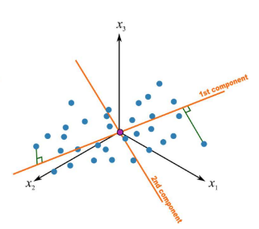
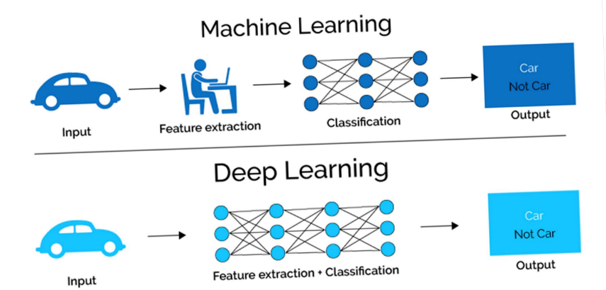
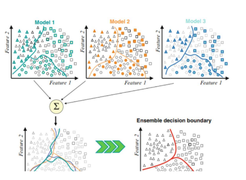
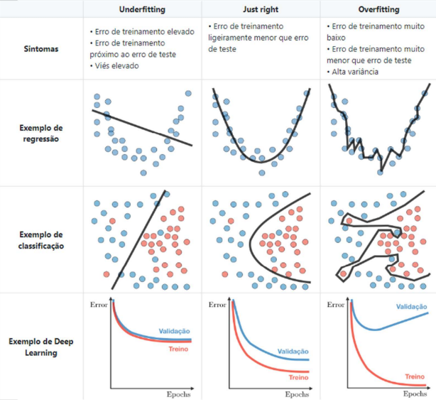

## Modelos de IA

**IA no ambiente corporativo**

---

**Modelos de Regressão:** Prevêem um valor contínuo com base em variáveis independentes.

---

**Modelos baseados em Árvore de Decisão:** Estruturam decisões em forma de árvore, dividindo os dados em subconjuntos para tomar decisões.

---

**Modelos baseados em Instâncias:** Aprendem com exemplos individuais, tomando decisões com base na similaridade com instâncias previamente vistas.

---

**Modelos de Agrupamento:** Agrupam dados similares em clusters ou grupos, identificando padrões e relações entre os dados.

---

**Redução de Dimensionalidade:** Reduz a complexidade dos dados mantendo as informações mais relevantes, facilitando a análise e visualização.

---

**Modelos de Redes Neurais:** Inspirados no funcionamento do cérebro, são modelos de aprendizado de máquina que consistem em camadas de neurônios interconectados.

---

**Ensemble Models:** Combinam vários modelos de aprendizado para melhorar a precisão e o desempenho preditivo.

---

