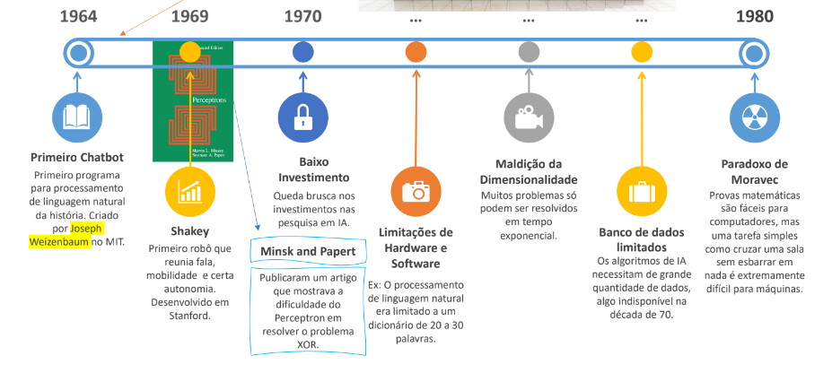

• **Aristoteles (384-322 a.C.)** - Primeiro a formular um conjunto preciso de leis que governam a parte racional da mente.
• **Ramon Lull (1315)** - Apresentou a ideia de que o raciocínio útil poderia na realidade ser conduzido por um artefato mecânico.
• **Thomas Hobbes (1588-1679)** - Propôs que o raciocínio era semelhante à computação numérica, ou seja, que “efetuamos somas e subtrações em nossos pensamentos silenciosos”.
• **Leonardo da Vinci (1452-1519)** - Projetou, mas não construiu, uma calculadora mecânica.

**1943**
- Warren McCulloch e Walter Pitts
  - Primeiro artigo sobre Redes Neurais (modelo de Neurônio).

**1949**
- Donald Hebb
  - Demonstrou uma regra de atualização de conexão entre neurônios.
- Claude Shannon
  - Programou uma máquina para jogar Xadrez.

**1950**
- Alan Turing
  - Propôs o teste de Turing no paper “Computing Machinery and Intelligence” – O jogo da Imitação.
- Marvin Minsky
  - Propôs o Snarc - Calculadora de operações matemáticas simulando sinapses, que são as ligações entre neurônios.

**1951**
- Claude Shannon
  - Desenvolveu o Teseu – um rato magnético que tentou resolver o labirinto em uma das primeiras experiências de IA. Foi uma das primeiras experiências de aprendizado envolvendo IA.

**Curiosidade**
- As Três Leis da Robótica - Propostas por Isaac Asimov
  - 1942 – Runaround
  - 1950 – I, Robot (livro)
  - 2004 – I, Robot (Filme)
- Leis da Robótica
  - 1a Lei: Um robô não pode ferir um ser humano ou, por inação, permitir que um ser humano sofra algum mal.
  - 2a Lei: Um robô deve obedecer as ordens que lhe sejam dadas por seres humanos exceto nos casos em que tais ordens entrem em conflito com a Primeira Lei.
  - 3a Lei: Um robô deve proteger sua própria existência desde que tal proteção não entre em conflito com a Primeira ou Segunda Leis.

**Dartmouth Conference (1956)**
- Na conferência de Dartmouth John McCarthy reuniu pesquisadores de diversos institutos/universidades que estavam direta ou indiretamente envolvidos com trabalhos relacionados a reprodução de comportamento inteligente.
- Na reunião o objetivo era avançar com a análise da conjetura básica de que “Cada aspecto da aprendizagem ou qualquer outra característica da inteligência pode, em princípio, ser descrita tão precisamente a ponto de ser construída uma máquina para simulá-la.”

**1956 - John McCarthy**
- Propôs o nome Inteligência Artificial para o novo campo de pesquisa.
- Propôs a linguagem de alto nível LISP.
- Introduziu o termo Machine Learning.

**Fase otimista da IA (1958 a 1970)**
- 1958, Herbert Simon e Allen Newell: “Dentro de dez anos um computador digital será o campeão mundial de xadrez” – “dentro de dez anos um computador digital irá descobrir e provar um novo teorema matemático importante”;
- 1965, Herbert Simon: “As máquinas serão capazes, dentro de vinte anos, de fazer qualquer trabalho que um homem possa fazer.”;
- 1967, Marvin Minsky: “Dentro de uma geração ... o problema de criar 'inteligência artificial' estará substancialmente resolvido.”;
- 1970, Marvin Minsky (na Life Magazine): “Em três a oito anos teremos uma máquina com a inteligência geral de um ser humano médio.”

**Era das trevas - 1o Inverno da IA**
- Falta de financiamento;
- Críticas por falta de resultados;
- Limitações teóricas no funcionamento das redes neurais;
- Inexistência de hardware adequado;
- Pesquisas restritas ao ambiente acadêmico e com pouca aplicabilidade;
- Baixa atenção ao setor (governo e empresas).

**Sistemas Especialistas - Um novo fôlego (1980)**
- Edward Feigenbaum, que trouxe os sistemas especialistas que tornou a utilização da IA possível em ambientes industriais altamente especializados.
- Aplicados em diversas áreas movimentou milhões de dólares desde 1980 até os dias atuais.
- Alguns sistemas especialistas importantes:
  - Dendral (1965) – identificava compostos a partir do sinal de um espectrômetro;
  - MYCIN (1972) – Diagnosticava doenças do sangue;
  - Digital Equipment Corporation implantou o primeiro sistema especialista comercial bem-sucedido, o R1. O programa ajudou a configurar pedidos de novos resultando em uma economia de cerca de 40 milhões de dólares por ano.

**2012**
- A Google lança o recurso de comando de voz no iPhone.
- Consolidação da Deep Learning Processamento de vídeos e imagens utilizando na prática aprendizado profundo.
